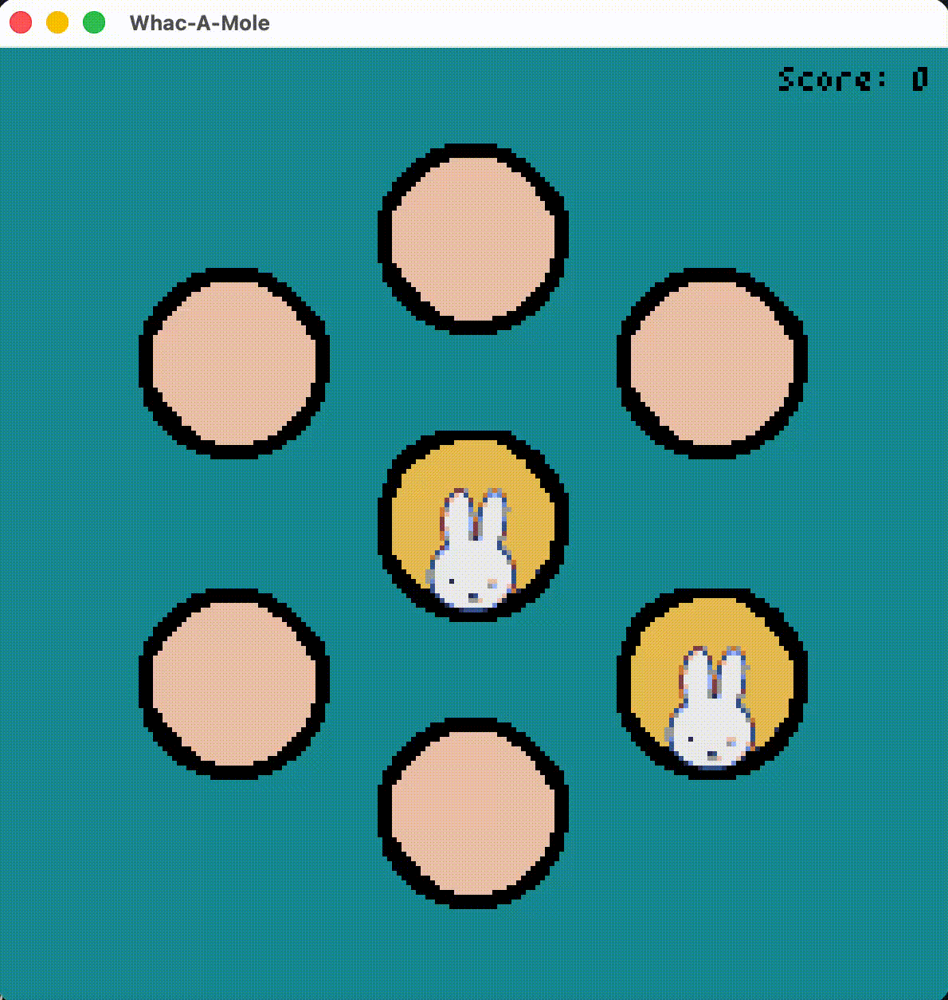

<h1 align = "center">
Anne Keir S. Liwanag
</h1>

liwanag.annekeir@gmail.com | asliwanag1@up.edu.ph | 09605331104

---

An organized and driven BS Computer Science student at the University of the Philippines, Diliman, with experience leading teams and events. Committed to putting in extra time and effort to learn new skills and support the team. Aspires to use these experiences to develop systems that improve lives through technology.

Proficient in Python, and familiar with C, Elm, and HTML. Has created several mini-games and activities with peers from Computer Science classes, and hopes to expand into data analysis and systems for future projects.

---

# 🎮 Projects

## Zuma Tower Defense
*Collab with a team of 4*
- Built in **Python and Pygame**
- Shoot Pokémon-themed enemies using Zuma-style color matching before they get through
- Place and upgrade towers on the grid for extra firepower
- Earn coins to spend in the shop on power-ups like Mega Bullet, Star, and Tower Frenzy
- Can play in endless mode to add name to leaderboard
- Includes custom sprites, music, and sound effects

🔗 [View Code] (https://github.com/akliwanag/zuma-tower-defense)

*Requires Pygame installed to run locally.*

## Whac-A-Mole
*Pair collab*
- Built in **Python and Pygame**
- Hit the right Miffy-themed moles to earn points
- Special mole types add twists to the game:
  - Bomb Mole – deducts points if hit
  - Lucky Mole – has a 50% chance to dodge a hit
  - Rich Mole – gains +1 point value each time it hides without being hit
  - Scaredy Mole – if hit, nearby moles get scared into hiding too
- Includes custom sprites and sound effects

🔗 [View Code] ()

*Requires Pygame installed to run locally.*

## FLAMES
*Pair collab*
- Built in **Elm with HTML**
- Implemented the classic FLAMES name-compatibility game as an Elm website
- Core count/crossout logic for computing the FLAMES result
- A mode switcher to toggle between crossout and count modes
- Can add multiple names, showing FLAMES results for each consecutive pair
- Add/remove name fields, with pairwise FLAMES results shown for every pair

🔗 [View Code] ()

*Ran using an online Elm compiler.*

<!--
**akliwanag/akliwanag** is a ✨ _special_ ✨ repository because its `README.md` (this file) appears on your GitHub profile.

Here are some ideas to get you started:

- 🔭 I’m currently working on ...
- 🌱 I’m currently learning ...
- 👯 I’m looking to collaborate on ...
- 🤔 I’m looking for help with ...
- 💬 Ask me about ...
- 📫 How to reach me: ...
- 😄 Pronouns: ...
- ⚡ Fun fact: ...
-->
